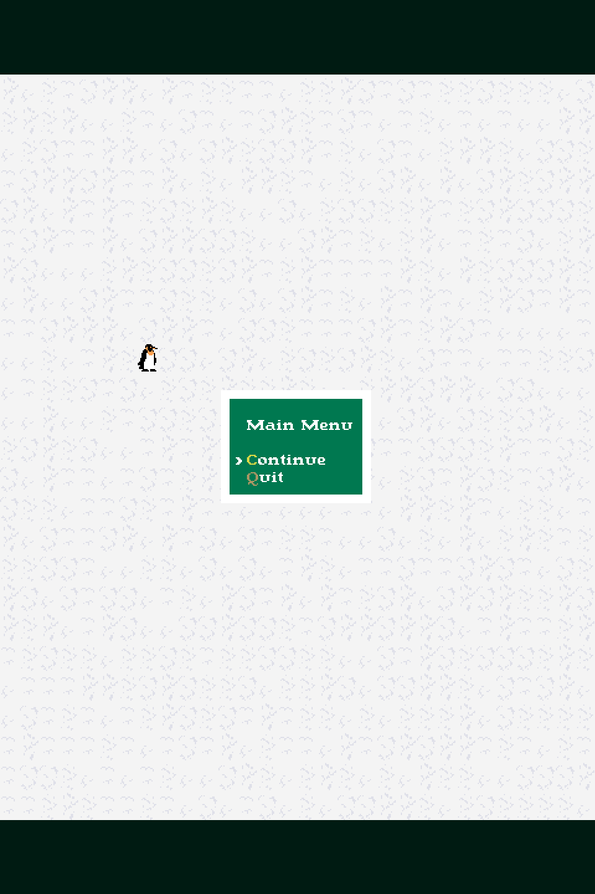

# Building
See required dependencies and instructions in `src/CMakeLists.txt`.

# TODO
[ ] Find a better way to handle menu state changes. Right now, the `Menu` class
doubles as the main menu and the in-game menu thanks to a `std::call_once`
trick, but that should be changed to something less cheesy. Also, that class
should be the basis for all menus (inventory menu, dialogs, etc.), so it needs
to generalize in a nicer way. Inheritance? Composition on the types of "actions"
we give it? An update phase might be needed too: on Enter, the input phase sets
some "execute" `bool` to true, and then the main menu's update phase transitions
the game state or the inventory menu's update phase opens a submenu with an
item's info, say.

[ ] Make a basic stat system for entities.

[ ] Add sidebar to display the player's stats.

[ ] Make NPCs.

[ ] Add transition to different zones as you walk off the edges of the grid. How
do we support multiple grid zones?

[ ] How do we save and load zones?

[ ] Everything else

# License
[GNU General Public License v3.0](https://www.gnu.org/licenses/gpl-3.0.html)
